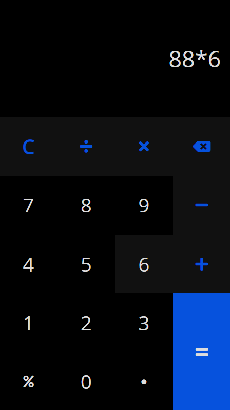

# Web Calculator

[Live Preview](https://) 🚀

> This is a simple calculator which works in the browser. It allows to add, subtract, divide, multiply numbers and also to calculate percentages. It's optimized for both mobile and desktop devices.

### Tech Stack

- Vanilla JavaScript
- SASS

---

### Mobile View Illustration

---

### Desktop View Illustration

